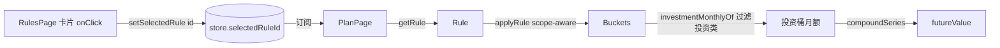
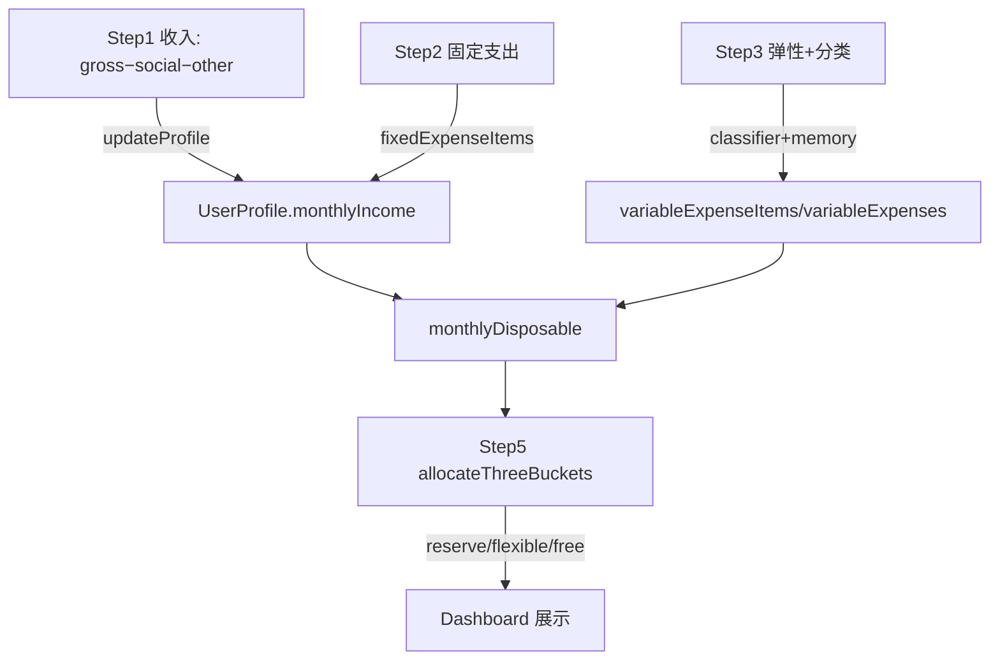
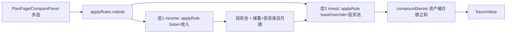

# FirstBucket v1.2 技术设计文档（蓝图）

| 项 | 内容 |
| --- | --- |
| 文档版本 | v1.2-DESIGN-v1 |
| 日期 | 2026-07-16 |
| 角色 | 系统架构师（基于 `docs/v1.2-prd.md` 产出，源码零改动） |
| 范围 | A 批(3) + B 批(2) + C 批(4) + D 批(2) = 11 项 PRD 需求，合并为 **T01–T10** 共 10 个工程任务 |
| 项目根目录 | `C:/Users/Admin/Desktop/vibe coding产出/FirstBucket_v2.0_交付物/FirstBucket` |

> 本文档只描述架构、接口与数据流，不修改任何源码。所有路径均为绝对路径，便于工程师直接定位。

---

## 0. 架构总览与核心不变式

v1.2 的目标是在**不破坏现有纯函数引擎语义**的前提下，补齐"法则可选 / 末值随法则 / 空态 / macOS 顶栏 / 数据徽章 / 五步画像 / 智能分类 / 三桶 / scope 标注 / 组合引擎"十项能力。

三条贯穿全局的不变式（工程师必须守护）：

1. **引擎纯函数语义不变**：`applyRule` / `compoundSeries` 仍是 `(profile, rule) => Bucket[]` 与 `(monthly, rate, months) => Point[]` 的纯函数，不读全局态、不改 `profile`。v1.2 对它们的修改**仅做加法**（新增可选第 3 参数 `baseOverride`、在返回对象上补 `bucketKey` 字段），不改动既有调用路径的返回含义。
2. **单一事实源**：`UserProfile`（`@core/domain/user.ts`）仍是唯一事实源；所有派生指标（`monthlyDisposable` / `totalMonthlyIncome` / `allocateThreeBuckets`）均为纯函数，禁止在组件中重算一份。
3. **CSS 唯一**：全项目样式仅 `src/renderer/styles.css` 一个文件；B4 的新增样式、布局改造一律落在此文件，**禁止新建 CSS 文件、禁止 CSS-in-JS**。

---

## 1. 任务分解（T01–T10）

> 每项对应 PRD 需求；"影响文件"列均含完整绝对路径。

### T01 · A1 接通法则选择入口（P0，阻塞下游）
- **目标**：让 `RulesPage` 的 12 法则卡片可点击 → `setSelectedRule(id)` → `PlanPage` 订阅 `selectedRuleId` 实时重渲染。
- **影响文件**
  - `C:/Users/Admin/Desktop/vibe coding产出/FirstBucket_v2.0_交付物/FirstBucket/src/renderer/pages/RulesPage.tsx`（在 `RULES.map` 卡片容器加 `onClick`，引入 `const setSelectedRule = useAppStore((s) => s.setSelectedRule)`，并用 `selectedRuleId === r.id` 高亮）
  - `C:/Users/Admin/Desktop/vibe coding产出/FirstBucket_v2.0_交付物/FirstBucket/src/renderer/stores/useAppStore.ts`（复用已存在的 `setSelectedRule`，**不改**）
  - `C:/Users/Admin/Desktop/vibe coding产出/FirstBucket_v2.0_交付物/FirstBucket/src/renderer/pages/PlanPage.tsx`（已基本就绪：`useMemo` 已按 `rule` 重算，仅确认空态分支）
  - `C:/Users/Admin/Desktop/vibe coding产出/FirstBucket_v2.0_交付物/FirstBucket/src/renderer/features/preset/PresetPicker.tsx`（**保持只写 `profile.preset` 不变**——与"选中法则"是两件事）
- **数据流**：`RulesPage onClick` → `setSelectedRule(r.id)`（store 写 `selectedRuleId`）→ 路由切 `/plan` → `PlanPage` 读 `selectedRuleId` → `getRule` → `applyRule` 生成 `generated`。
- **验收锚点**：PRD §7 清单第 1 项。

### T02 · A2 修 A/B 末值按法则投资桶复利（P0）
- **目标**：`buildPlanView.futureValue` 改为取**该法则生成方案中"投资/增值类"桶的月额**做 `compoundSeries`，而非 `monthlyDisposable`。
- **新增函数**（落点 `src/renderer/features/plan/`）
  - `investmentBuckets.ts`：`export const INVESTMENT_BUCKET_KEYS: ReadonlySet<string>`（投资类 key 完整集合，见 §3.2）+ `export function isInvestmentKey(k: string): boolean`
  - `metrics.ts` 内新增 `export function investmentMonthlyOf(rule: Rule, profile: UserProfile): number`
- **改造 `buildPlanView`**：`futureValue = series[last].value`，其中 `series = compoundSeries(investmentMonthlyOf(rule, profile), annualRateFor(profile.riskProfile), months)`。
- **Bucket 类型微调**（加法）：`src/renderer/@core/domain/bucket.ts` 的 `Bucket` 增加可选 `bucketKey?: string`；`engine.ts applyRule` 在返回对象补 `bucketKey: a.bucketKey`（`investmentMonthlyOf` 据此判定，无需从 `id` 反解，规避 `rule.id` 含 `-` 的歧义）。
- **影响文件**
  - `C:/Users/Admin/Desktop/vibe coding产出/FirstBucket_v2.0_交付物/FirstBucket/src/renderer/features/plan/metrics.ts`
  - `C:/Users/Admin/Desktop/vibe coding产出/FirstBucket_v2.0_交付物/FirstBucket/src/renderer/features/budget/engine.ts`（`compoundSeries` 复用；`applyRule` scope 感知见 T09）
  - `C:/Users/Admin/Desktop/vibe coding产出/FirstBucket_v2.0_交付物/FirstBucket/src/renderer/@core/domain/bucket.ts`（加 `bucketKey?`）
- **验收锚点**：PRD §7 清单第 2 项；切换法则末值变化。

### T03 · A3 复利可视空态守卫（P0）
- **目标**：`profile` 为 null **或** `monthlyDisposable(profile) <= 0` 时渲染空态，不画 0 值平线。
- **影响文件**：`C:/Users/Admin/Desktop/vibe coding产出/FirstBucket_v2.0_交付物/FirstBucket/src/renderer/pages/VisualizerPage.tsx`（在 `useMemo` 后将 `model.monthly <= 0` 与 `!profile` 归并同一空态分支，文案"请先完善收入与支出"）。
- **细节**：复用已有的 `monthlyDisposable` 导入；空态判断放在 `useMemo` 之后、图表渲染之前。
- **验收锚点**：PRD §7 清单第 3 项。

### T04 · B4 macOS 风格无边框顶栏（P1，全平台套用）
- **目标**：`frame:false` + 红黄绿窗口按钮 + 拖拽区 + ipc 控制；所有页面顶部适配。平台策略：**全平台套用 macOS 观感**（用户在 Windows 上明确要 macOS 外观，PRD O4 默认）。
- **影响文件**
  - `C:/Users/Admin/Desktop/vibe coding产出/FirstBucket_v2.0_交付物/FirstBucket/src/electron/main.ts`（第 53 行 `BrowserWindow` 加 `frame: false`；注册 `ipcMain.handle('window:minimize' | 'window:close' | 'window:toggleMaximize')`，回调 `win.minimize()/win.close()/win.isMaximized()?win.unmaximize():win.maximize()`）
  - `C:/Users/Admin/Desktop/vibe coding产出/FirstBucket_v2.0_交付物/FirstBucket/src/electron/preload.ts`（`contextBridge` 暴露 `window.{minimize, close, toggleMaximize}`，与现有 `FirstBucket` 同结构；禁止直接 `require`）
  - 新建 `C:/Users/Admin/Desktop/vibe coding产出/FirstBucket_v2.0_交付物/FirstBucket/src/renderer/components/TitleBar.tsx`（左侧三圆钮 + 中间 `-webkit-app-region: drag` 拖拽区 + "FirstBucket" 文字；按钮区 `-webkit-app-region: no-drag`）
  - `C:/Users/Admin/Desktop/vibe coding产出/FirstBucket_v2.0_交付物/FirstBucket/src/renderer/App.tsx`（在 `app-shell` 顶层挂载 `<TitleBar />`；将 `app-shell` 改为纵向 flex，新增 `.app-body` 横向 flex 包裹 `Nav`+`main-content`）
  - `C:/Users/Admin/Desktop/vibe coding产出/FirstBucket_v2.0_交付物/FirstBucket/src/renderer/styles.css`（新增 `.app-titlebar`/`.app-body`/`.titlebar-btn` 等；`.app-shell` 改 `flex-direction: column`；`main-content` 顶部**无需额外 padding**——TitleBar 作为 flex 兄弟自然把内容下推；仅移动端 `Nav` 隐藏时确认 `.page-wrapper` padding 不变）
  - `C:/Users/Admin/Desktop/vibe coding产出/FirstBucket_v2.0_交付物/FirstBucket/src/renderer/@core/electron-api.d.ts`（为 `Window` 增 `minimize/close/toggleMaximize` 类型）
- **布局策略（关键）**：采用"列向 app-shell"而非 overlay，天然避免逐页补 padding；但 Windows 下需回归 `frame:false` 的窗口阴影/圆角与双击标题栏最大化（PRD R1）。
- **验收锚点**：PRD §7 清单第 4 项。

### T05 · B5 徽章重构为数据达成型（P1）
- **目标**：5 徽章全数据驱动；移除 `onboard`，`plan` 取自 `buckets.length`，`classify` 采用 O3 默认启发式。
- **影响文件**
  - `C:/Users/Admin/Desktop/vibe coding产出/FirstBucket_v2.0_交付物/FirstBucket/src/renderer/features/profile/health.ts`（`computeBadges` 重写：输入 `ctx` 改为 `{ hasPlan: boolean }`，删除 `onboarded`；5 徽章见 §3.3）
  - `C:/Users/Admin/Desktop/vibe coding产出/FirstBucket_v2.0_交付物/FirstBucket/src/renderer/pages/ProfilePage.tsx`（第 50 行 `hasPlan` 由 `!!selectedRuleId` 改为 `buckets.length > 0`）
  - `C:/Users/Admin/Desktop/vibe coding产出/FirstBucket_v2.0_交付物/FirstBucket/src/renderer/features/review/ReviewList.tsx`（第 25 行同步 `hasPlan` 口径）
  - `C:/Users/Admin/Desktop/vibe coding产出/FirstBucket_v2.0_交付物/FirstBucket/src/renderer/features/report/planReport.ts`（第 33 行同步）
- **验收锚点**：PRD §7 清单第 5 项。

### T06 · C6 五步财务画像（P1，替代 Onboarding）
- **目标**：五步向导（①收入 ②固定支出 ③弹性支出+分类 ④财务画像 ⑤三桶分配）替代现有轻量 `Onboarding`；完成后 `setOnboarded(true)` 进 Dashboard，profile 落盘。
- **影响文件**
  - `C:/Users/Admin/Desktop/vibe coding产出/FirstBucket_v2.0_交付物/FirstBucket/src/renderer/@core/domain/user.ts`（扩展字段，见 §3.4；全部可选，JSON 增量兼容旧档）
  - `C:/Users/Admin/Desktop/vibe coding产出/FirstBucket_v2.0_交付物/FirstBucket/src/renderer/components/Onboarding.tsx`（重写为五步，或新建 `src/renderer/features/onboarding/FiveStepWizard.tsx` 由 `App.tsx` 调用；保留 `{!onboarded && <Onboarding …/>}` 触发）
  - `C:/Users/Admin/Desktop/vibe coding产出/FirstBucket_v2.0_交付物/FirstBucket/src/renderer/App.tsx`（交换组件即可，触发机制不变）
  - `C:/Users/Admin/Desktop/vibe coding产出/FirstBucket_v2.0_交付物/FirstBucket/src/renderer/stores/useAppStore.ts`（`updateProfile` 复用，不新增状态机库；向导内部步骤态用组件内 `useState`）
- **字段映射**：Step1 到手 = `grossMonthlyIncome − socialInsuranceDeduction − otherDeductions + otherIncome`；写入 `monthlyIncome`（到手口径，与现有语义一致）。Step4 展示 `monthlyDisposable` 与 Step5 复用 C8。
- **验收锚点**：PRD §7 清单第 6 项。

### T07 · C7 智能支出分类系统（P1）
- **目标**：关键词→类别预填、可拖拽改、频率摊月、偏好记忆。
- **新建模块** `src/renderer/features/classify/`
  - `keywordMap.ts`：`export const KEYWORD_MAP: Record<string, ExpenseCategory>`（医疗应急/娱乐消费/社交维系/家居维修/其他；如 生病/药/医院→medical-emergency，演唱会/电影/旅游→entertainment，人情/聚餐/份子→social，手机/维修/家电→home-repair）
  - `classifier.ts`：`export function classify(text: string): ExpenseCategory`、`export function toMonthlyAmount(item: ExpenseItem): number`（一次性 ÷12）、`export function normalize(raw: {text,amount,frequency}): ExpenseItem`
  - `memory.ts`：`export function rememberOverride(keyword: string, category: ExpenseCategory)` / `loadOverride(keyword)`（localStorage key `fb_classify_memory`，与现有 `fb_*` 模式一致）
- **嵌入**：五步向导 Step3（T06）调用上述函数；分类结果汇入 `profile.variableExpenseItems` 与 `variableExpenses` 小计。
- **影响文件**：仅新建模块 + 被 T06 的向导引用；`user.ts` 增加 `variableExpenseItems`（§3.4）。
- **验收锚点**：PRD §7 清单第 7 项。

### T08 · C8 三桶分配（P1）
- **目标**：基于可支配余额 D 自动分三桶，合计 = D。
- **新建** `C:/Users/Admin/Desktop/vibe coding产出/FirstBucket_v2.0_交付物/FirstBucket/src/renderer/features/budget/threeBuckets.ts`
  - `export function allocateThreeBuckets(profile: UserProfile): ThreeBuckets`
  - 定义见 §3.5；三桶仅作画像洞察展示，**不写入 SQLite 桶表**（那是法则分桶）。
- **复用**：五步向导 Step5 与 Dashboard（`ProfilePage`）调用；与 `monthlyDisposable` 同源。
- **验收锚点**：PRD §7 清单第 8 项。

### T09 · C9 + D10 scope 标注与 applyRule scope 感知（P1，合并交付）
- **目标**：`Rule` 加 `scope: 'income'|'invest'|'withdraw'`（必填字面量联合），12 法则标注 6 income + 5 invest + 1 withdraw；`applyRule` 按 scope 选基数。
- **影响文件**
  - `C:/Users/Admin/Desktop/vibe coding产出/FirstBucket_v2.0_交付物/FirstBucket/src/renderer/@core/domain/rule.ts`（加 `scope` 字段 + 12 法则逐项标注；`getRule`/`recommend` 不受影响）
  - `C:/Users/Admin/Desktop/vibe coding产出/FirstBucket_v2.0_交付物/FirstBucket/src/renderer/features/budget/engine.ts`（`applyRule`：`if (rule.scope === 'invest') base = investmentPool(profile); else base = totalMonthlyIncome(profile)`；新增可选第 3 参数 `baseOverride?: number` 供组合引擎覆盖）
  - `C:/Users/Admin/Desktop/vibe coding产出/FirstBucket_v2.0_交付物/FirstBucket/src/renderer/pages/RulesPage.tsx`（卡片可按 scope 分组/过滤 `withdraw`）
  - `C:/Users/Admin/Desktop/vibe coding产出/FirstBucket_v2.0_交付物/FirstBucket/src/renderer/features/compare/ComparePanel.tsx`（`<select>` 排除 `scope==='withdraw'`，PRD R3）
- **Scope 归类表**（12 法则）：

  | scope | 数量 | 法则 id |
  | --- | --- | --- |
  | `income` | 6 | `4321` `sp-quadrant` `50-30-20` `six-jars` `kakeibo` `coast-fire` |
  | `invest` | 5 | `100-age` `core-satellite` `all-weather` `buffett-90-10` `60-40` |
  | `withdraw` | 1 | `four-percent` |

- **验收锚点**：PRD §7 清单第 9、10 项。

### T10 · D11 多选组合引擎（P2）
- **目标**：`applyRules(ruleIds, profile)` 走"收入层加权 → 投资池 → 投资层加权拆分"两层流水线；末值随组合变化；默认等权（O5），预留加权扩展点。
- **新建** `C:/Users/Admin/Desktop/vibe coding产出/FirstBucket_v2.0_交付物/FirstBucket/src/renderer/features/rules/combine.ts`
  - `export function applyRules(ruleIds: string[], profile: UserProfile, opts?: { weights?: Partial<Record<string, number>> }): PlanView`
  - 内部：统一类目字典映射 `CATEGORY_MAP`、统一资产字典映射 `ASSET_MAP`、等权 `weightedMerge`
  - 拒绝/忽略 `withdraw` 入参（PRD R3）
- **影响文件**
  - `C:/Users/Admin/Desktop/vibe coding产出/FirstBucket_v2.0_交付物/FirstBucket/src/renderer/features/plan/metrics.ts`（`buildPlanView` 增加组合重载：入参由 `(profile, rule)` 扩展为 `(profile, rule | ruleIds[])`）
  - `C:/Users/Admin/Desktop/vibe coding产出/FirstBucket_v2.0_交付物/FirstBucket/src/renderer/pages/PlanPage.tsx`（两层多选 UI：收入级多选上限 1 + 投资级多选上限 2，见 O6）
  - `C:/Users/Admin/Desktop/vibe coding产出/FirstBucket_v2.0_交付物/FirstBucket/src/renderer/features/compare/ComparePanel.tsx`（组合视图多选 UI）
- **验收锚点**：PRD §7 清单第 11 项。

---

## 2. 受影响文件清单（集中汇总）

| 文件（绝对路径） | 涉及任务 | 改动性质 |
| --- | --- | --- |
| `…/src/renderer/pages/RulesPage.tsx` | T01, T09, T10 | 加 onClick/高亮、scope 分组、组合多选 UI |
| `…/src/renderer/pages/PlanPage.tsx` | T01, T10 | 确认重渲染、组合多选 UI |
| `…/src/renderer/pages/VisualizerPage.tsx` | T03 | 空态守卫 |
| `…/src/renderer/pages/ProfilePage.tsx` | T05, T08 | `hasPlan` 口径、三桶展示 |
| `…/src/renderer/features/compare/ComparePanel.tsx` | T09, T10 | 排除 withdraw、组合多选 |
| `…/src/renderer/features/plan/metrics.ts` | T02, T10 | `investmentMonthlyOf`、组合 `buildPlanView` |
| `…/src/renderer/features/plan/investmentBuckets.ts`（新） | T02 | 投资类 key 集合 |
| `…/src/renderer/features/budget/engine.ts` | T02, T09 | `bucketKey` 字段、`applyRule` scope + `baseOverride` |
| `…/src/renderer/features/budget/threeBuckets.ts`（新） | T08 | 三桶分配纯函数 |
| `…/src/renderer/features/rules/combine.ts`（新） | T10 | 组合引擎 |
| `…/src/renderer/features/classify/keywordMap.ts`（新） | T07 | 关键词词典 |
| `…/src/renderer/features/classify/classifier.ts`（新） | T07 | 分类/频率摊月 |
| `…/src/renderer/features/classify/memory.ts`（新） | T07 | 偏好记忆 |
| `…/src/renderer/features/profile/health.ts` | T05 | 重写 `computeBadges` |
| `…/src/renderer/features/review/ReviewList.tsx` | T05 | `hasPlan` 口径 |
| `…/src/renderer/features/report/planReport.ts` | T05 | `hasPlan` 口径 |
| `…/src/renderer/@core/domain/rule.ts` | T09 | `scope` 字段 + 12 标注 |
| `…/src/renderer/@core/domain/bucket.ts` | T02 | 加 `bucketKey?` |
| `…/src/renderer/@core/domain/user.ts` | T06 | 扩展字段（增量兼容） |
| `…/src/renderer/components/Onboarding.tsx` | T06, T07 | 重写为五步向导 |
| `…/src/renderer/components/TitleBar.tsx`（新） | T04 | macOS 顶栏 |
| `…/src/renderer/App.tsx` | T04, T06 | 挂载 TitleBar、交换向导 |
| `…/src/renderer/styles.css` | T04 | 布局 + 顶栏样式（唯一 CSS 文件） |
| `…/src/renderer/@core/electron-api.d.ts` | T04 | 窗口 API 类型 |
| `…/src/electron/main.ts` | T04 | `frame:false` + ipc 窗口控制 |
| `…/src/electron/preload.ts` | T04 | 暴露窗口安全 API |
| `…/src/renderer/stores/useAppStore.ts` | T01, T06 | 复用 `setSelectedRule`/`updateProfile` |

---

## 3. 关键设计点详述（含 O1–O6 架构决断）

### 3.1 引擎函数签名（复用 / 新增 / 改造）

```ts
// —— 复用（语义不变）——
applyRule(profile, rule): Bucket[]                         // engine.ts；仅加法：补 bucketKey、加可选 baseOverride
compoundSeries(monthly, annualRate, months): CompoundPoint[]   // engine.ts
totalMonthlyIncome(p): number                              // user.ts
monthlyDisposable(p): number                               // user.ts

// —— 新增（T02）——
INVESTMENT_BUCKET_KEYS: ReadonlySet<string>                // investmentBuckets.ts
isInvestmentKey(k: string): boolean                        // investmentBuckets.ts
investmentMonthlyOf(rule: Rule, profile: UserProfile): number   // metrics.ts
//   内部：applyRule(profile, rule) → 过滤 bucketKey ∈ INVESTMENT_BUCKET_KEYS → 求和 monthlyAmount

// —— 改造（T02）buildPlanView ——
buildPlanView(profile, rule): PlanView
//   futureValue = compoundSeries(investmentMonthlyOf(rule, profile), annualRateFor(risk), months)[last].value
//   （单法则视图；组合视图见下）

// —— 新增（T09）scope 感知 applyRule ——
applyRule(profile, rule, baseOverride?: number): Bucket[]
//   base = baseOverride ?? (rule.scope === 'invest' ? investmentPool(profile) : totalMonthlyIncome(profile))

// —— 新增（T09）投资池（O1 默认）——
investmentPool(profile: UserProfile): number
//   = monthlyDisposable(profile)   // 单 invest 法则视图默认口径

// —— 新增（T08）三桶 ——
allocateThreeBuckets(profile): { reserve; flexible; free; total; reserveTarget; reserveMet }

// —— 新增（T10）组合引擎 ——
applyRules(ruleIds: string[], profile, opts?: { weights?: Partial<Record<string, number>> }): PlanView
```

### 3.2 O2 · 投资类 bucketKey 完整集合（决定末值大小）

采用 PRD §2 A2 建议集合，并**明确排除** `cash/safe/protect`（保本/保命非增值）：

```
投资/增值类（计入复利）：
invest, save, saving, grow, equity, stock, index,
core, satellite, bond, ltbond, mtbond, commodity, tbill,
principal, sprint

消费/保障/提领类（不计入）：
living, need, want, play, edu, give, culture, food,
cash, protect, safe, insurance, surprise, withdraw
```

> 判定规则：凡落在"投资/增值类"集合的桶月额参与 `compoundSeries`；其余（含 `four-percent` 的 `withdraw`/`principal` 中 `principal` 虽在集合内，但 `four-percent` 被排除出方案，不参与）。

### 3.3 O3 · classify 徽章判定口径（默认启发式）

`classify` 徽章 **默认 = `profile.variableExpenses > 0`**（即用户至少录入过弹性支出，等价于走完 C7 分类）。理由：C7 的产出即 `variableExpenses` 小计，零新增标志位即可表达"完成收支分类"；后续如需更精确（如"存在 ≥1 条经分类明细"），可平滑升级为 `variableExpenseItems?.length > 0`。

5 徽章判定函数输入与阈值：

| 徽章 | 输入来源 | 阈值（earned） |
| --- | --- | --- |
| `surplus` | `monthlyDisposable(profile)` | `> 0` |
| `emergency` | `currentSavings` / `fixedExpenses+variableExpenses` | `currentSavings >= 3×(fixed+variable)` 且 `fixed+variable > 0` |
| `goal` | `profile.goals.length` | `> 0` |
| `plan` | `useAppStore.buckets.length` | `> 0`（**非 `selectedRuleId`**） |
| `classify` | `profile.variableExpenses` | `> 0`（O3 默认） |

> `computeBadges` 的 `ctx` 入参由 `{ onboarded, hasPlan }` 收紧为 `{ hasPlan: boolean }`；`onboard` 徽章删除。

### 3.4 C6 · UserProfile 扩展字段（R6，JSON 增量兼容）

```ts
// 现有字段保留；新增以下可选字段（旧档缺省 undefined，createEmptyProfile 给默认值）
grossMonthlyIncome?: number;     // 税前月薪
socialInsuranceDeduction?: number; // 社保公积金扣除
otherDeductions?: number;        // 其他扣除
otherIncome?: number;            // 其他收入（与现有 incomeOther 并存，前者为向导语义别名）
fixedExpenseItems?: ExpenseItem[];   // 固定支出明细
variableExpenseItems?: ExpenseItem[]; // 弹性支出明细

interface ExpenseItem {
  id: string;
  label: string;            // 用户输入文本，如 "生病 800"
  amount: number;           // 金额
  frequency: 'once' | 'monthly' | 'annual'; // 一次性/月度/年度
  systemCategory: ExpenseCategory; // 关键词预填
  userCategory?: ExpenseCategory;   // 用户拖拽修正
  remembered?: boolean;     // 是否来自偏好记忆
}
type ExpenseCategory = 'medical-emergency' | 'entertainment' | 'social' | 'home-repair' | 'other';
```

> 到手 `monthlyIncome` 仍为权威口径；Step1 计算 `monthlyIncome = gross − social − otherDeductions + otherIncome` 后 `updateProfile`。旧档无 `gross*` 时 `monthlyIncome` 仍有效，向后兼容。

### 3.5 C8 · 三桶分配规则与边界

```
D = monthlyDisposable(profile)                         // 可支配余额
reserveTarget = 3 × (fixedExpenses + variableExpenses) // 备用金目标（扩展自 health.ts 的 3×fixed）
reserve  = min(D, reserveTarget)                        // 备用金：固定不动，仅限失业/重病/大额意外
remaining = max(0, D - reserve)
flexible = min(remaining, variableExpenses)             // 灵活应急金：补弹性缺口，不娱乐（默认=1个月弹性缓冲）
free     = remaining - flexible                         // 自由支配：剩余全部（储蓄/投资/消费自由）
// 不变量：reserve + flexible + free === D （不溢出、不短缺）
// reserveMet = reserve >= reserveTarget
```

> `flexible` 的"1 个月弹性缓冲"为默认可调常量（`FLEXIBLE_RATIO = variableExpenses`），后续产品可改为比例系数；三桶不写 SQLite。

### 3.6 C9 · 投资池口径（O1 默认）

- **单 invest 法则视图**（PlanPage 单视图，无收入层可借力）：
  `investmentPool(profile) = monthlyDisposable(profile)`（假设用户将全部可支配余额投入，保证与组合视图数学连续）。
- **组合视图**（见 3.7）：投资池 = 收入层输出的"储蓄+投资"类目月额合计；若无收入级法则入选，则回退为 `monthlyDisposable(profile)`。

### 3.7 D11 · 两层组合流水线（绝不对跨层百分比求平均）

```
输入 ruleIds[]（已过滤 withdraw；≤1 income + ≤2 invest，见 O6）
                       │
层1 收入层（对每个 income 法则）── applyRule(profile, rule, totalMonthlyIncome)
   → 归一化到统一类目字典 CATEGORY_MAP {生活/必需, 想要/弹性, 储蓄, 投资/增值, 保障/保险, 教育/玩乐/其他}
   → 等权加权平均（opts.weights 扩展点）→ 各类目月额
   → 投资池 = 储蓄类目月额 + 投资类目月额
   （若无 income 法则：投资池 = monthlyDisposable(profile)）
                       │
层2 投资层（对每个 invest 法则）── applyRule(profile, rule, 投资池)   // baseOverride=投资池
   → 归一化到统一资产字典 ASSET_MAP {权益类, 固收类, 商品, 现金/货基}
   → 等权加权平均 → 资产桶月额
                       │
末值 = compoundSeries(层2 全部资产桶月额之和, annualRateFor(risk), months)[last].value
```

- **统一类目字典 `CATEGORY_MAP`**：将各 income 法则的 `bucketKey` 映射到统一类目（如 `4321.living→生活/必需`，`50-30-20.need→生活/必需`，`save/saving/invest→储蓄+投资`，`insurance→保障/保险`，`edu/play/give→教育/玩乐/其他`）。
- **统一资产字典 `ASSET_MAP`**：`equity/stock/index/core/satellite→权益类`，`bond/ltbond/mtbond/tbill→固收类`，`commodity→商品`，`cash/safe→现金/货基`。
- **等权（O5）**：同层各法则权重 `= 1/n`；`opts.weights` 为预留加权扩展点（后续按 `applicability` 打分）。

### 3.8 O4 · TitleBar 平台策略 = 全平台 macOS 观感

`frame:false` + 红黄绿 + 拖拽区在 **win32 / macOS / linux 全平台套用**（用户明确要 macOS 外观）。Windows 额外回归：窗口阴影/圆角、双击标题栏最大化、拖拽区不吞按钮（`-webkit-app-region: no-drag` 包住按钮）。

### 3.9 O5 / O6 决断

- **O5 等权**：组合默认等权，权重通过 `applyRules` 的 `opts.weights` 预留，v1.2 不改权重策略。
- **O6 组合上限**：最多 **1 个 income + 1~2 个 invest**；UI 分两层选择（收入级多选上限 1、投资级多选上限 2）；`withdraw` 不出现在选择列表。

---

## 4. 数据流图（文字 + mermaid）

### 4.1 法则选中 → 方案（T01/T02/T09）


### 4.2 五步画像 → 三桶（T06/T07/T08）


### 4.3 组合计算（T10/T02）


---

## 5. 对 PRD 开放问题 O1–O6 的架构侧决断（汇总）

| 开放问题 | 架构决断（采用 PRD 推荐默认） |
| --- | --- |
| **O1** 投资池口径 | 单 invest 法则视图：`investmentPool = monthlyDisposable(profile)`；组合视图：收入层"储蓄+投资"类目月额合计，无 income 法则时回退 `monthlyDisposable` |
| **O2** 投资桶识别清单 | 采用 §3.2 完整集合（16 个投资类 key），明确排除 `cash/safe/protect` |
| **O3** classify 判定 | `variableExpenses > 0` 启发式（零新增标志位，可平滑升级为 `variableExpenseItems.length > 0`） |
| **O4** TitleBar 平台策略 | 全平台套用 macOS 观感（`frame:false` + 红黄绿 + 拖拽） |
| **O5** 组合权重 | 同层等权；`applyRules` 预留 `opts.weights` 扩展点 |
| **O6** 组合上限与 UI | 最多 1 income + 1~2 invest；两层选择 UI；`withdraw` 不入场 |

---

## 6. 对工程师的 4 项硬约束（必须遵守）

> 任何改动若违反以下约束，视为不合格交付。

1. **零新增运行时依赖**：不引入任何新 npm 包。拖拽分类用原生 HTML5 Drag-and-Drop API；窗口控制走既有 `ipcMain`/`contextBridge`；不新增 UI 框架/状态库/动画库。
2. **不动核心引擎纯函数语义**：`applyRule` / `compoundSeries` / `monthlyDisposable` / `totalMonthlyIncome` 的既有调用路径返回含义不变。对它们的修改**仅限加法**（`applyRule` 新增可选 `baseOverride` 第 3 参数、返回对象补 `bucketKey`；`buildPlanView` 扩展组合重载）。所有新增函数（`investmentMonthlyOf` / `investmentPool` / `allocateThreeBuckets` / `applyRules`）必须为纯函数：不读全局态、不改 `profile`、不触发副作用。
3. **store 改动最小**：`useAppStore` 仅复用既有 `setSelectedRule` / `updateProfile`，不新增状态机库；五步向导的步骤态用组件内 `useState`，**不进全局 store**；不引入新的持久化层（偏好记忆用既有 `localStorage` `fb_*` 模式）。
4. **CSS 唯一且改动前全量扫描**：所有样式仍在唯一文件 `src/renderer/styles.css`；**禁止新建 CSS 文件、禁止 CSS-in-JS**。改动 `.app-shell` / `.main-content` / `.page-wrapper` / `.nav` 等任何既有 class 前，必须 `grep` 全量扫描该 `className` 的所有引用页面，确认无遗漏（尤其 B4 的布局改造会同时影响所有页面的顶部空间）。

---

## 7. 交付检查清单（对齐 PRD §7）

- [ ] T01 A1：`selectedRuleId` 更新 → PlanPage 实时重渲染
- [ ] T02 A2：`futureValue` 来自 `investmentMonthlyOf`，切换法则末值变化
- [ ] T03 A3：收入为 0 时 Visualizer 空态，无 0 值曲线
- [ ] T04 B4：`frame:false` + TitleBar + ipc 窗口控制 + 全页顶部适配
- [ ] T05 B5：5 徽章全数据驱动，`onboard`→`classify`，`plan` 取 `buckets.length`
- [ ] T06 C6：五步向导替代 Onboarding，完成后进 Dashboard
- [ ] T07 C7：关键词分类 + 拖拽确认 + 频率摊月 + 偏好记忆
- [ ] T08 C8：`allocateThreeBuckets` 三桶合计 = 可支配余额
- [ ] T09 C9/D10：`rule.ts` 加 `scope`，`applyRule` scope 感知，12 法则标注完整
- [ ] T10 D11：`applyRules` 两层合并，末值随组合变化
- [ ] 全量 `tsc` 通过；`setSelectedRule` 无回归误用；4 项硬约束全部满足
